```{r echo=FALSE,results='hide'}


```


# Introduction

There is a newborn in the family of jamovi modules: jAMM, jamovi Advanced Mediation Models. The module adds itself to the `medmod` menu, along with `mediation` and `moderation` functions, expanding jamovi compabilities in the realm of mediation and conditional mediation. jAMM aims at providing a unique interface for users dealing with advanced models, with several mediators, independent variables and moderators. Ultimately, it represents an easy-to-use alternative to PROCESS package in SPSS. But jAMM does not require to pick out some predefined model template: Just set the variables, look at the path diagram, and enjoy the results.

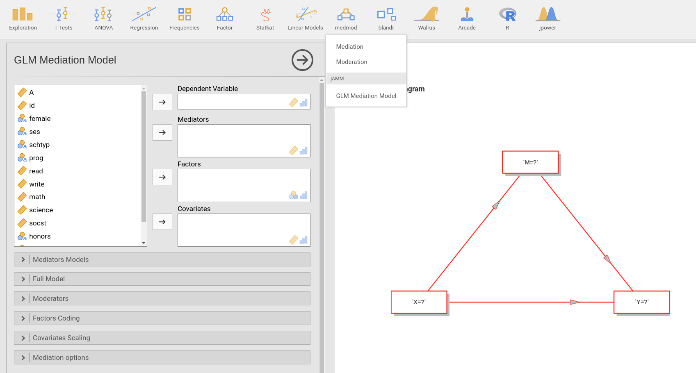


As compared with other software dealing with mediation, 
jAMM takes advantage of jamovi on the fly sync between input and output,
so it builds the path diagram of your model as you set the variables in the input or refine the model under
scrutiny. This feature makes it easy for the user to explore models with different levels of complexity, 
or to test specific models hypothesized by the researcher. 
It also features some smart rules to guess what the  user may wants to estimate, though the ultimate control over the analyses is always in the user's hands. The statistical estimates are all obtained employing [R lavaan package](https://cran.r-project.org/web/packages/lavaan/lavaan.pdf), whose utility in [mediation analysis](http://lavaan.ugent.be/tutorial/mediation.html) is well-established.

In this blog we show some key features of jAMM, with particular focus on the user interface and the model building process. To do so, we employ the [hsbdemo dataset](https://stats.idre.ucla.edu/stat/data/hsbdemo.csv) with school performance variables, borrowed from the [IDRE stats web page](https://stats.idre.ucla.edu/stata/faq/how-can-i-do-mediation-analysis-with-the-sem-command/). The dataset is useful here because it features several continuous variables (`read` `write` `science` `math`) indicating participants abilities in specific subjects, and some categorical variables, such as gender (named `female`). 

# Mediation with one or more mediators

Let assume we want to estimate the effect of `read` abilities on performance in `science`, with the hypothesis that this effect is mediatated by `math` abilities. A simple 3-variables mediation model can be estimated by setting each variable to its intended role.

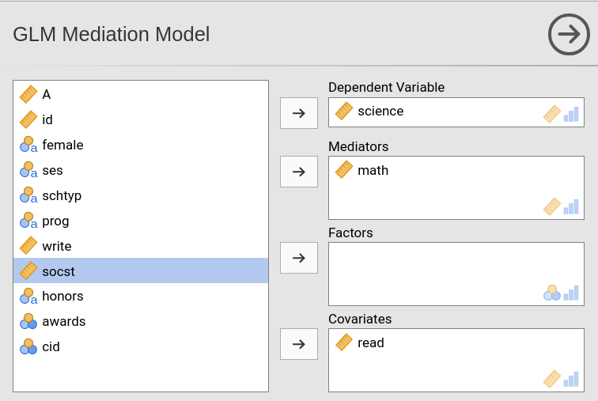

As soon as we set the variables role, the module fills in the models and updates the path diagrams. 

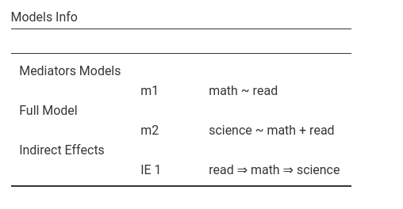

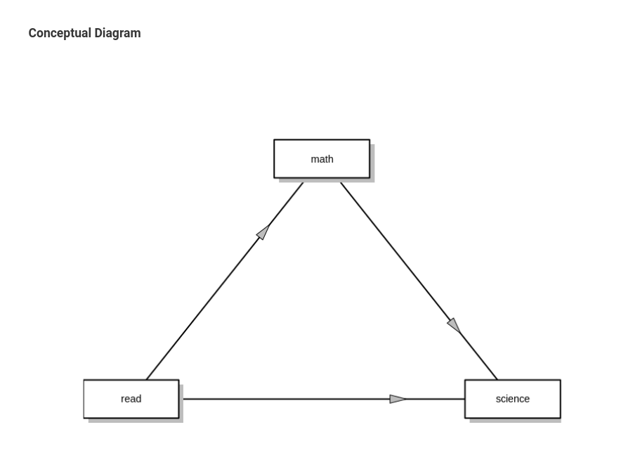

If we are happy with the model structure, we can go and check the results. 

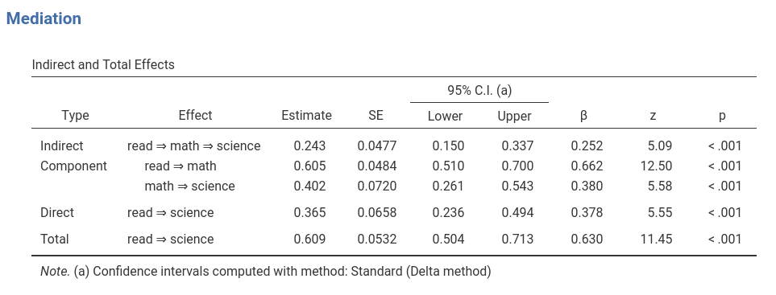

The `Mediation` table presents the indirect effects (`Indirect` row) with their labels, the SE, z-test, p-values and confidence intervals. By default, the confidence intervals are computed using large-sample approximation formulas, similar to the Sobel Test ([see lavaan docs for details](https://cran.r-project.org/web/packages/lavaan/lavaan.pdf)). If boostraap methods are preferred, they can be selected in the `Mediation Options` tab.

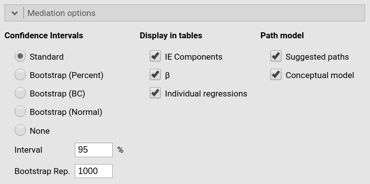

Along with the estimates of the _indirect effect_ we also obtain the indirect effect components, that are the coefficients required to estimate the indirect effects. Using the classical notation of mediation, in which $IE=a \cdot b$, the coefficients $a$ and $b$ are the components of the indirect effect. We also get the direct effect, that is the part of the total effect not mediated by the mediator, and the total effect (in the example, the overall effect of `read` on `science`). 

All estimates and SE are computed within a path model estimated with Maximum likelihood method with [R lavaan package](https://cran.r-project.org/web/packages/lavaan/lavaan.pdf). If one wishes to check the coefficients obtained with a more traditional series of (OLS) regressions, they are listed just below the first table. 

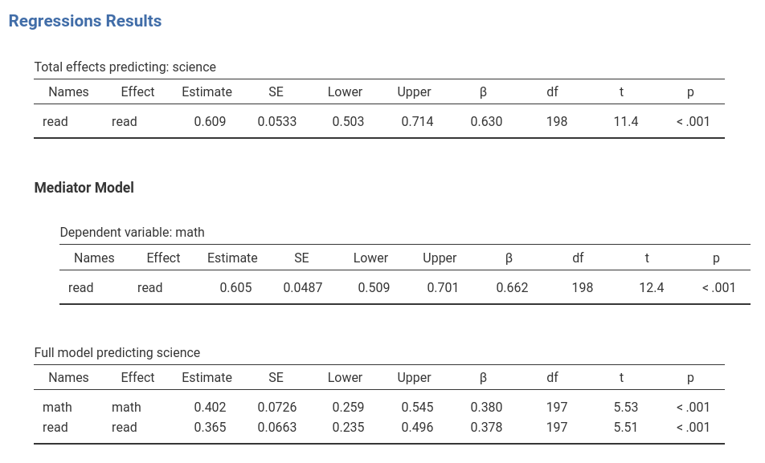

We can now expand the model. Assume we want to add `write` (the ability to write) as an additional mediator. We simply add the variable in the `mediators` field, and the model results are ready in the output window.

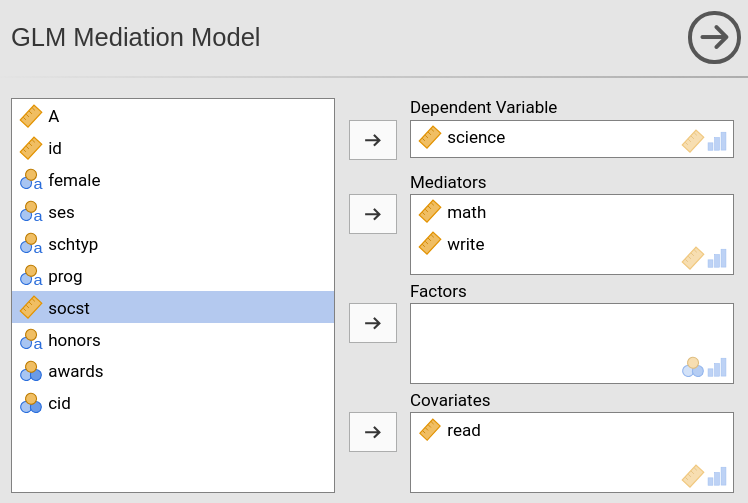
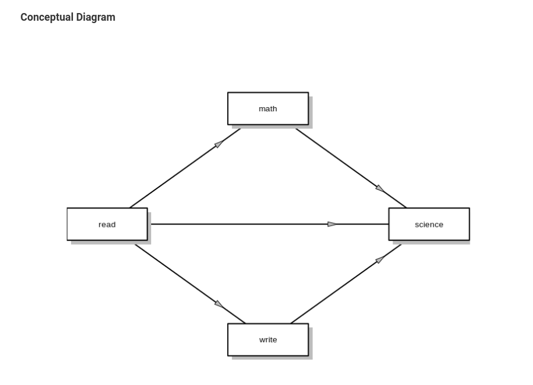

In the results table, we will find now two different _indirect effects_, one for the `math` mediator, one for the `write` mediator, plus the components of those effects.

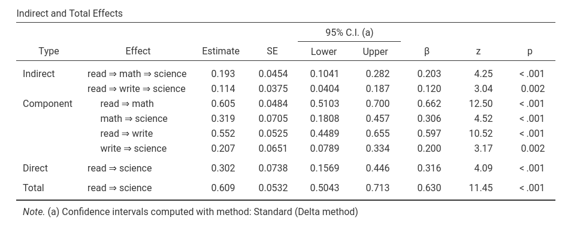

# Chains of mediators

The model guessing rules implemented in jAMM assume that mediators are parallel by default. However, the model can be changed at will. Assume we want to test a model in which  `read` goes on `write`, which in turn goes on `math`, which eventually influences `science`. This will put the mediators in a chain. To setup this model, let explore the UI panels dealing with the models. The are two panels: the `Mediators models` panel, and the `Full model` panel.
The `Mediators models` panel presents (on the right side) one model for each mediator. By default, only the independent variables are added to each model, giving rise to a parallel mediator model.

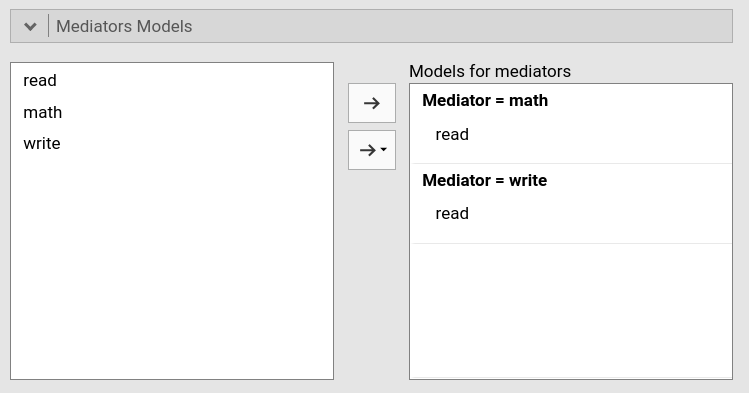

If we wish to declare a model where mediators are ordered in a chain, we simply add the more distal mediators as predictors of the most proximal ones. In our example, we include `write` in the model predicting `math`, obtaining the overall model we required.

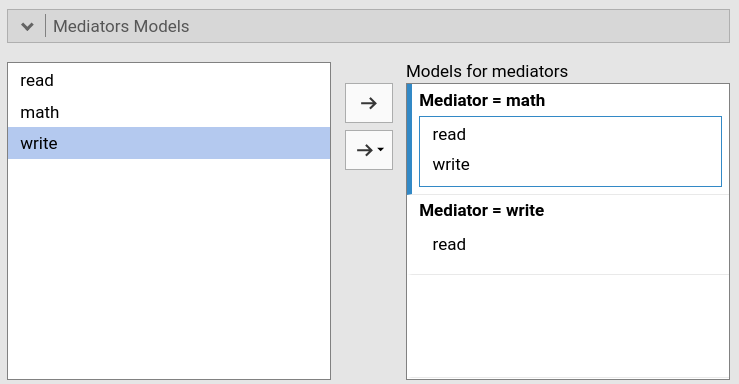


Also the `Mediation` results table is updated, and now we see all the indirect effects included in the mediation analysis.

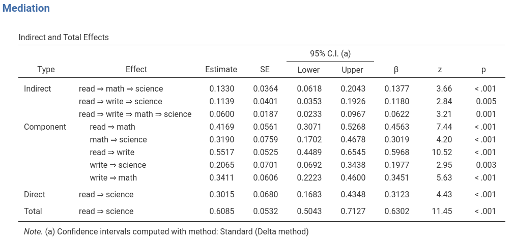

# Conditional mediation

Let's go back to the first simple model, the one with `read` effect on `science` mediated by `math`. Assume now we suspect that a categorical variable, gender, may moderated the mediated effect. The moderation hypthesis simply states that the mediated effect of `math` is different when evaluated for women as compated with men. To estimate the model, we fist need to include `female` as an independent variable by dragging it in the `factors` field.

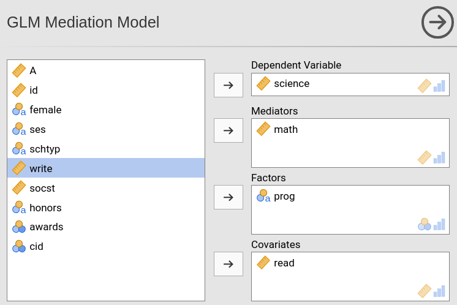

However, we also need to specify that `female` should be a moderator of the model, and thus we set it in the `Moderators` panel.

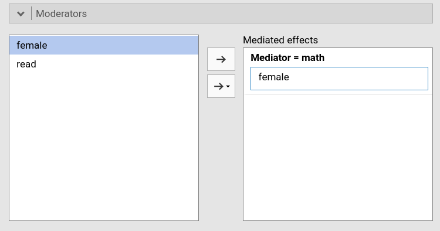

As we do so, jAMM changes the models in order to include all the required interactions. In this case, the models look like this.

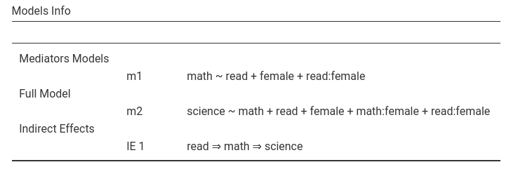
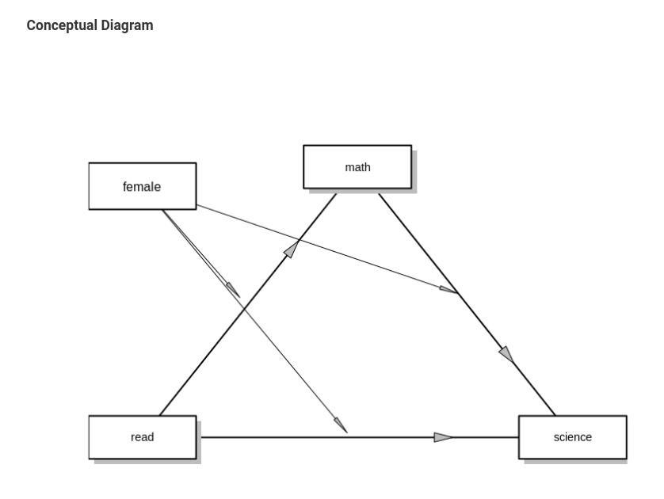

For conditional mediation, the output first presents the interactions required to evaluated the conditional part of the model.

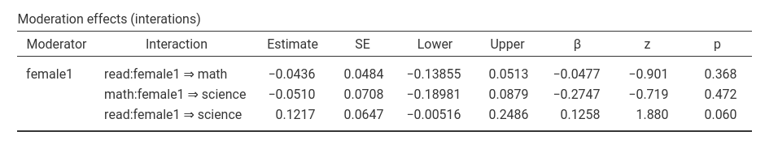

We can see that none of the interactions is significant, so we can conclude that gender does not moderated the path from `read` to `math`, nor it moderates the path from `math` to `science`. Therefore, it does not moderate the mediated effect `read->math->science`.

Nontheless, we can see the remaining tables to appreciate the information available in jAMM output. When a moderation is present, we would like to see how the mediated effect changes at different levels of the moderator. That is exactly the information in the next table.

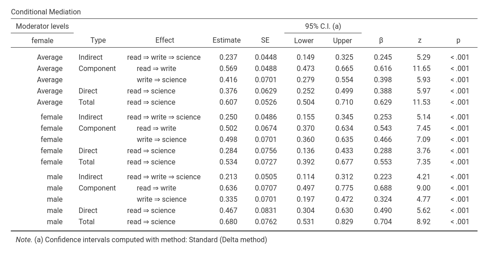

We can see in the "Conditional Mediation" table the indirect effect, the direct effect and the total effect repeated three times. The first block is for the "average effect", that is all the effects are estimated for the centered moderator. The other two blocks show the estimation of the mediation model for the two levels of the moderator. If the moderator is a continuous variable, the mediation model is estimated for three different "interesting" levels: by default, they are the means and one standard deviation above and below the average. Using "Covariate scaling" pannel, one can choose to condition the mediation model at different levels of the continuous moderator, such as different interesting percentiles.


# Conclusions

